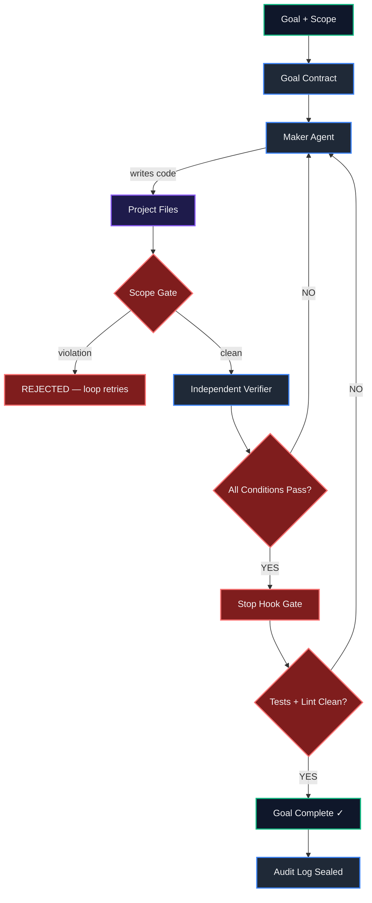

<div align="center">

# Loop Engineering v3.0

**A control plane for autonomous AI coding agents.**

Give your agent a goal. The loop runs it, scopes it, verifies it, and doesn't stop until it's proven to work.

[](https://github.com/MohdSaleh/loops-engineering-for-coding-agents)
[](https://python.org)
[](LICENSE)

</div>

---

## Table of Contents

- [Overview](#overview)
- [How It Works](#how-it-works)
- [What It Prevents](#what-it-prevents)
- [Architecture](#architecture)
- [Getting Started](#getting-started)
- [Agentic IDE Setup](#agentic-ide-setup)
- [The Goal Lifecycle](#the-goal-lifecycle)
- [Project Completion](#project-completion)
- [System Maintenance](#system-maintenance)
- [Running Tests](#running-tests)
- [Contributing](#contributing)
- [License](#license)

---

## Overview

Loop Engineering shifts you from prompting agents to designing the loop that runs them.

Instead of interacting with an agent turn-by-turn, you define a **goal** and a **scope**. The loop takes it from there — it runs your AI agent inside a bounded workspace, independently verifies the result against deterministic conditions, and retries with a different strategy on failure. It stops only when every condition passes.

The system enforces two planes inside your Git repository:

- **Control Plane** (`.agentic/`) — governs *how* the work is done: path ownership, protocol, event log, verification scripts.
- **Project Plane** (`src/`, `tests/`, etc.) — the actual application code your agent produces.

The Maker agent writes code only in the Project Plane. It can never touch the Control Plane. A separate, isolated Verifier agent checks the work without access to the Maker's logs or reasoning. Only the Verifier can declare a goal complete.

---

## How It Works

**1. You define a goal** — a plain-English task with an explicit scope:

```json
{
  "goal_raw": "Add a health endpoint and tests.",
  "allowed_write_paths": ["src/**", "tests/**"],
  "denied_write_paths": [".agentic/**", "AGENTS.md", ".env*"],
  "completion_conditions": [
    { "type": "A", "command": ["pytest", "-q"], "expected_exit_code": 0 }
  ]
}
```

**2. The Maker agent implements** — scoped to exactly the paths you authorized. Protected paths (`.env`, `secrets/**`, `production/**`) are always denied regardless of any matching pattern.

**3. The Scope Gate checks the diff** — any changed file outside `allowed_write_paths` is rejected before verification runs.

**4. The Verifier runs independently** — it receives the codebase and the completion conditions, but not the Maker's session logs or confidence statements. It executes every check and binds each PASS to the candidate Git tree.

**5. The Stop Gate runs final validation** — tests, types, lint — before the goal can close.

**6. The audit log seals** — an append-only, hash-chained `LOOP-EVENTS.jsonl` records every attempt, the Git SHA before and after, evidence hashes, and the verified outcome.

---

## What It Prevents

| Failure | Without Loop Engineering | With Loop Engineering |
|---------|--------------------------|----------------------|
| **Self-grading** | Maker declares its own work done | Verifier is structurally isolated — no access to Maker logs (`[W1]`) |
| **Test manipulation** | Agent weakens or deletes tests to pass CI | Rule `LA-006` forbids weakening any test; scope gate rejects unauthorized test changes |
| **Premature completion** | Agent stops at 80%, calls it done | Goal closes only when every deterministic condition exits 0 |
| **Runaway scope** | Agent modifies `.env`, configs, or production files | `workspace.json` path ownership blocks all protected paths — hard deny |
| **No rollback** | Unknown what the agent changed | `git_sha_before` captured before first edit; rollback is always deterministic |

---

## Architecture

```
CONTROL PLANE (.agentic/)              PROJECT PLANE
├── protocol/   ← execution rules      src/, app/, packages/
├── config/     ← workspace.json       tests/, e2e/, docs/
├── policy/     ← VISION, SPEC, REQS   package.json, pyproject.toml
├── runtime/    ← LOOP-EVENTS.jsonl    ... your existing layout
├── knowledge/  ← source graph
├── schemas/    ← validation schemas
└── scripts/    ← agenticctl CLI
```

A project goal can never write to the Control Plane. The system that governs the agent is structurally protected from the agent.

### Execution Flow



---

## Getting Started

### Prerequisites

- Python 3.8+
- Git (the target must be a Git repository)

---

### New Project (Greenfield)

#### Manual

```bash
mkdir my-app && cd my-app
python3 /path/to/loop-engineering/install.py . --init-git
```

The installer detects your project layout (`src/`, `tests/`, `package.json`, `pyproject.toml`, etc.), scaffolds the `.agentic/` control plane, places `AGENTS.md` at the root, and creates a baseline commit.

#### Via Agent

```
Initialize a new Git repository. Run `python3 /path/to/loop-engineering/install.py . --init-git`.
Verify the system with `python3 .agentic/scripts/agenticctl.py --root . validate`.
```

---

### Existing Project (Brownfield)

#### Manual

```bash
# From your project root
python3 /path/to/loop-engineering/install.py .

# Adjust source and test roots if needed
vim .agentic/config/workspace.json

# Validate and commit
python3 .agentic/scripts/agenticctl.py --root . validate
git add AGENTS.md .agentic
git commit -m "chore: integrate Loop Engineering v3.0"
```

#### Via Agent

```
Run `python3 /path/to/loop-engineering/install.py .` to install the control plane.
Configure source_roots and test_roots in `.agentic/config/workspace.json` to match the existing layout.
Run `python3 .agentic/scripts/agenticctl.py --root . validate`, then commit AGENTS.md and .agentic/.
```

---

## Agentic IDE Setup

`AGENTS.md` is the instruction entrypoint for any AI coding tool. Each tool's rule file tells the agent to read it first and respect the control plane boundary.

### Antigravity IDE

Zero config — auto-discovers `AGENTS.md` and `workspace.json`.

### Cursor

`.cursorrules`:
```
Always read AGENTS.md before writing code.
Do NOT modify .agentic/** or AGENTS.md.
Stay within the allowed_write_paths of the active goal.
```

Or `.cursor/rules/loop-governance.mdc`:
```markdown
---
description: Loop Engineering boundary rules
globs: *
---
Read AGENTS.md. Never modify .agentic/**.
```

### Windsurf

`.windsurfrules`:
```
Read AGENTS.md at startup.
Do NOT write to .agentic/** or AGENTS.md.
Stay within authorized project paths.
```

### VS Code & GitHub Copilot

`.github/copilot-instructions.md`:
```markdown
This repository uses Loop Engineering v3.0.
Follow AGENTS.md. Do not mutate .agentic/**.
```

### Claude Code

`CLAUDE.md`:
```markdown
- Read AGENTS.md before editing any file.
- .agentic/** and AGENTS.md are write-protected.
- Validate: python3 .agentic/scripts/agenticctl.py --root . validate
- Register goal: agenticctl register-goal --goal-file <file>
- Verify goal:   agenticctl verify --goal-id <id>
```

### Cline / Roo Code

`.clinerules`:
```
Read AGENTS.md before editing code.
Never write to .agentic/** unless under a SYSTEM_MAINTENANCE goal.
Run `python3 .agentic/scripts/agenticctl.py --root . validate` before finishing.
```

### Aider

`.aider.instructions.md`:
```markdown
Check AGENTS.md for path constraints before mutating files.
Never edit .agentic/ or AGENTS.md.
All writes must stay within the goal's allowed_write_paths.
```

---

## The Goal Lifecycle

```bash
# Convenience alias
alias agenticctl="python3 .agentic/scripts/agenticctl.py --root ."
```

### 1 — Register

```bash
agenticctl register-goal --goal-file examples/goal.project-task.json
```

Captures `git_sha_before`, locks path scope, appends `GOAL_CREATED` to the event log.

### 2 — Maker Implements

```bash
agenticctl maker-packet --goal-id G001
# agent writes code...
agenticctl record-attempt --goal-id G001 --task-id T001 --result PASS --files-json '["src/health.py"]'
```

### 3 — Scope Gate

```bash
agenticctl verify-scope --goal-id G001
```

Diffs baseline against candidate. Rejects any change outside `allowed_write_paths` or touching protected/control-plane paths.

### 4 — Independent Verification

```bash
agenticctl verify --goal-id G001
```

Completion condition types:
- **Type A** — exit code (`pytest -q` → 0)
- **Type B** — file state (`config.json` exists)
- **Type C** — numeric metric (coverage ≥ 80%)
- **Type D** — LLM judgment (must be pre-approved in `VISION.md`, never invented at runtime)

### 5 — Stop Gate

```bash
agenticctl stop-gate --goal-id G001
```

### 6 — Knowledge Graph & Close

```bash
agenticctl kg-build   --goal-id G001
agenticctl kg-promote --goal-id G001
agenticctl complete-goal --goal-id G001 --outcome "Health endpoint added, all tests pass"
```

---

## Project Completion

A completed goal is not a completed project. The project closes only when:

1. Every `MUST` requirement in `.agentic/policy/REQUIREMENTS.json` is `VERIFIED`.
2. Project-wide acceptance checks pass on the final Git tree.
3. No blocking issues remain.
4. The final Knowledge Graph release matches the accepted tree.
5. You run:

```bash
agenticctl accept-project
```

---

## System Maintenance

Ordinary goals cannot write to `.agentic/**`. To update the control plane itself:

1. Set `goal_kind: SYSTEM_MAINTENANCE` in the goal contract.
2. Set `system_change_authorized: true`.
3. Run under the Protocol Maintainer role.

A project goal can never rewrite the system that judges it.

---

## Running Tests

```bash
python3 tests/test_install_and_boundary.py
python3 tests/test_goal_lifecycle.py
python3 tests/test_full_cycle.py
```

---

## Contributing

Contributions are welcome. Changes to `.agentic/**` require a `SYSTEM_MAINTENANCE` goal. See `.agentic/protocol/LOOP-ENGINEERING-v3.0.md` for the full protocol.

---

## License

MIT — see [LICENSE](LICENSE) for details.
